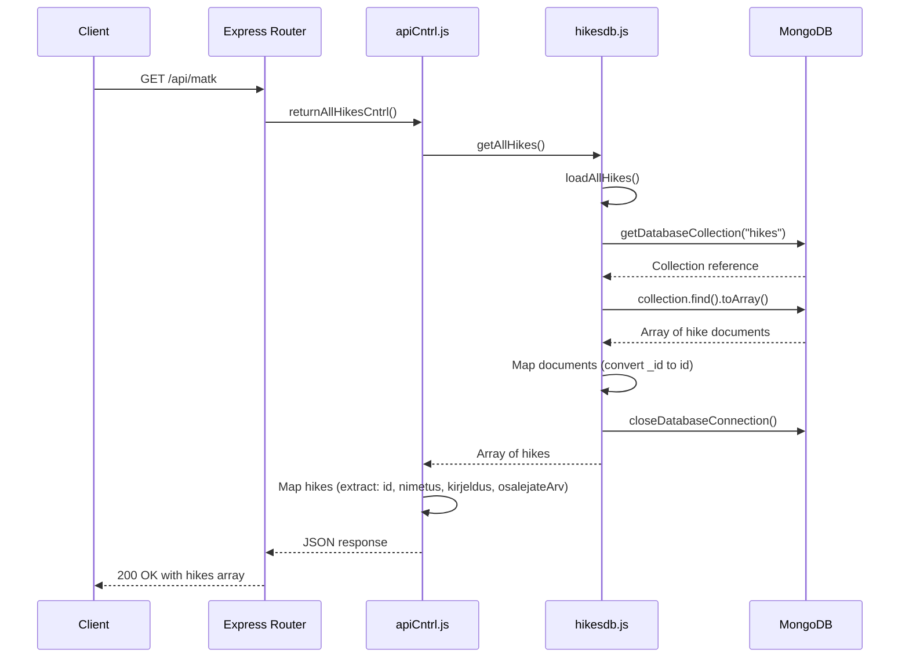

# Project Summary

## Overview
Matkaklubi (Hiking Club) is a Node.js web application built with Express.js for managing hiking events and participant registrations.

## Technology Stack
- **Backend**: Node.js with Express.js 5.1.0
- **Template Engine**: EJS 3.1.10
- **Database**: MongoDB 7.0.0
- **Module System**: ES6 modules

## Project Structure

### Controllers
- `viewCntrl.js` - Handles view rendering (index, contact, hike details, news, registration)
- `apiCntrl.js` - REST API endpoints for hike management (CRUD operations, participant registration)
- `adminview.js` - Admin interface controller

### Models
- `hikes.js` - File-based data model (JSON storage)
- `hikesdb.js` - MongoDB database operations for hikes

### Views
- EJS templates located in `views/` directory (index, matk, uudised, kontakt, admin)
- Static assets in `public/` (CSS, JavaScript, images)

## Features
- Display and manage hiking events
- Participant registration for hikes
- News section
- Contact page
- Admin interface
- REST API for hike management (GET, POST, PATCH, DELETE)
- Participant registration via API

## API Endpoints
- `GET /api/matk` - Get all hikes
- `GET /api/matk/:id` - Get hike by ID
- `POST /api/matk` - Add new hike
- `PATCH /api/matk/:id` - Update hike
- `DELETE /api/matk/:id` - Delete hike
- `POST /api/matk/:id/osalejad` - Register participant for hike
- `GET /api/uudised` - Get news

## Routes
- `/` - Home page (list of hikes)
- `/matk/:id` - Hike details page
- `/matk/:id/registreerumine` - Registration page
- `/uudised` - News page
- `/kontakt` - Contact page
- `/admin` - Admin interface

## API Flow Diagram

### Fetching All Hikes

